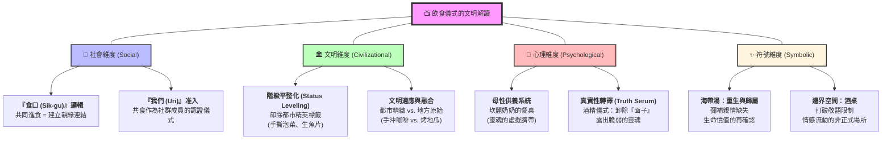

# 《海岸村恰恰恰》深度解讀報告 (Civilizational Decoding)

## 1. 社會操作系統 (Social OS)：非正式共同體的防禦機制
- **文明衝突點**：都市的「契約邏輯」（尹惠珍）撞上鄉村的「人情邏輯」（公辰村）。惠珍初期的不適應來自於她試圖用「法律、規章、隱私」來對抗村落的「透明監控」。
- **國王隱喻**：洪斗植作為「沒錢的國王」，他統治的是**社會資本**而非貨幣資產。他拒絕進入首爾的競爭系統，實際上是建立了一個具備高度韌性的「局部文明」。
- **生存定價**：全劇在挑戰「成功」的定義。洪班長的「首爾大」標籤被用來消解階級偏見，證明「向下紮根」是一種洞察後的選擇。

## 2. 文化符號與收割 (Symbolism Harvest)
- **傘與雨的辯證**：洪班長在雨中不撐傘，象徵他處於「自我處刑」狀態（拒絕保護）。惠珍為他撐傘或陪他淋雨，象徵著兩人的防禦機制同時瓦解。
- **鞋子的路徑**：惠珍遺失的高跟鞋代表都市身分的斷裂。洪班長給她的膠拖鞋（雖然醜但實用），象徵著「與土地連結」的新生命起點。
- **食物的盟約**：奶奶們的「共食」是惠珍獲得村落准入證的關鍵儀式。

## 3. 飲食儀式的文明解密
劇中每一道菜都是「情感與權力」的交匯點。
- **牛肉湯 (Yukgaejang)**：葬禮上的標配，代表共同體在面對死亡時的「生命供養」與驅邪儀式。惠珍在葬禮上喝下這碗湯，象徵她正式進入公辰的「生死循環」。
- **手撕泡菜**：長輩對晚輩「去防禦化」的最高親暱，象徵惠珍從都市隔離轉向地方接納。
- **海帶湯**：家族關係的補償，斗植透過烹飪完成了「重生」的儀式。

## 4. 人格圖騰：刺蝟困境與獵犬人格
- **刺蝟 (Yoon Hye-jin)**：典型的「迴避型依附」。外表多刺以防受傷，渴望溫暖卻又害怕靠近（叔本華的刺蝟困境）。
- **黃金獵犬 (Hong Du-sik)**：主動出擊、熱情守護。他的任務是讓刺蝟學會「收起刺」，以及在共同體中找到安全距離。

## 5. 價值觀的動態平衡：進步與停滯的辯證
- **洪班長：停滯的救贖**。提供人情連結，但具有創傷後的「自我凍結」風險，拒絕參與現代文明的進化。
- **尹醫師：焦慮的進步**。代表專業主義與卓越，但具有靈魂乾枯與社會孤立的風險。
- **對位平衡**：健康的文明需要「斗植的底座（連結）」來支撐「惠珍的成長（卓越）」。

## 6. 人類循環經濟：修補與再利用
公辰村是一個「人的再生工廠」。
- **人的再造 (Upcycle)**：它將都市文明中被定義為「廢棄資源」的失業者（如斗植、春在），透過社群網絡進行情緒修補與角色重新定義。
- **系統韌性**：相對於都市的「線性消耗」，公辰村透過非貨幣交換與情感回饋，建立了一個能量閉環。

## 7. 跨界洞察 (Cross-Domain Insights)
- **流域聚落與共同體**：公辰村的結構與台灣早期漁村聚落高度相似。那種「無隱私的守望相助」是資源匱乏環境下的生存最優解。這種社會韌性是理解台灣地方學的重要參考。
