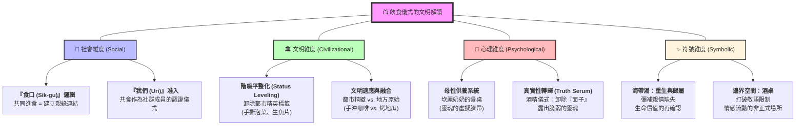
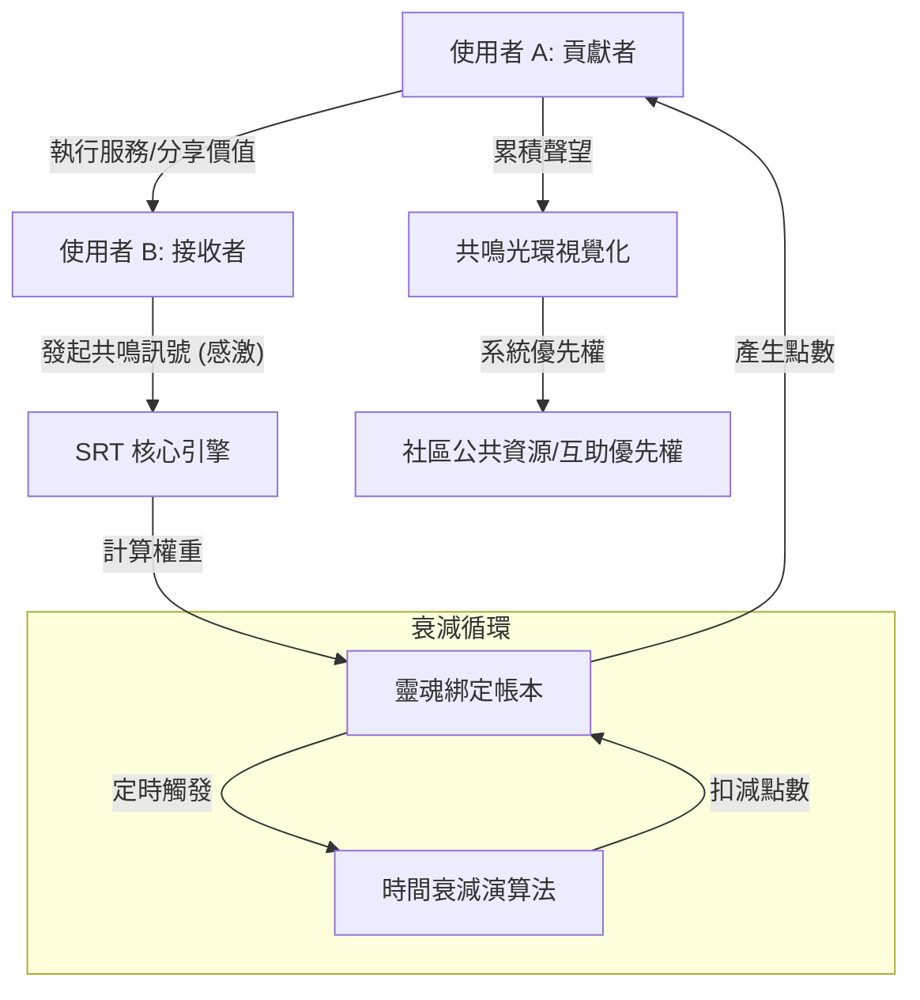

# 《韓劇羅曼史解讀手冊》兩層式目錄 (TOC)

這份目錄是本書的架構藍圖，後續將根據此目錄進行章節內容的詳細編寫。

---

## # 第 1 章：垂直社會的語言秩序 —— 權力與距離的刻度
*   **1.1 敬語與平語的心理邊界**：解析韓語層級如何定義兩人的社會距離，以及「切換語言」在劇中的情感爆發力。
*   **1.2 職場與家庭的語言壓制**：探討下級對上級、晚輩對長輩在語言上受到的結構性約束。
*   **1.3 語言作為「接納」的訊號**：當一個群體開始對你講平語，這代表了什麼樣的文明認同？

## # 第 2 章：儒家文明的現代變體 —— 隱形的契約
*   **2.1 家族優先主義 (Family First)**：解析為何角色會為了家族利益犧牲個人愛情，這背後的集體主義邏輯。
*   **2.2 「面子」的社會成本**：探討韓國社會中「他人的眼光（Cha-myeon）」如何形塑角色的行為決策。
*   **2.3 報恩與償還的循環**：韓國文化中「債（Debt）」與「情（Jeong）」的糾纏。

## # 第 3 章：集體主義的「我們」邏輯 —— 共同體的准入
*   **3.1 「我們 (Uri)」的排他性與包容性**：分析一個人如何從「外人」變成「我們的人」的標準程序。
*   **3.2 鄰里共同體的社會監控**：鄉村劇中常見的「無隱私」環境，如何成為一種社會安全網。
*   **3.3 被孤立的恐懼**：解析韓國社會中「排擠」作為最嚴厲懲罰的心理威懾。

## # 第 4 章：韓國式的生存焦慮 —— 愛情的定價權
*   **4.1 學歷與階級圖騰 (SKY Castle)**：解析首爾大學等標籤在婚姻市場中的絕對權威。
*   **4.2 財閥與平民的對立邏輯**：探討韓劇如何透過階級反差，辯證財富與幸福的關係。
*   **4.3 都市競爭與回鄉潮**：分析「北漂受挫」後的心理補償與地方價值的重新發現。

## # 第 5 章：物件與空間的隱喻 —— 情感的視覺編碼
*   **5.1 傘與雨的防禦機制**：解析「撐傘」作為守望與接納的符號意義。
*   **5.2 鞋子與路徑的支撐**：從繫鞋帶到送鞋，物件如何承載對他人生命路徑的守護。
*   **5.3 燈塔、大海與邊界空間**：特定地理景觀如何映射角色的內心孤獨與守望。

## # 第 6 章：食物的社交語言 —— 最高級的情感盟約
*   **6.1 「吃過飯了嗎？」的真實含意**：分析食物如何作為韓國文化中最基礎的關懷與連結。
*   **6.2 泡菜、雜菜與海帶湯**：特定食物在劇中的儀式感及其背後的代際情感傳遞。
*   **6.3 酒桌上的真理儀式**：探討酒精如何作為卸下社交防禦、交換真心話的媒介。

## # 第 7 章：傷痕者與倖存者原型 —— 心理動力的源頭
*   **7.1 倖存者愧疚 (Survivor's Guilt)**：解析角色為何會因為過去的悲劇而推開幸福。
*   **7.2 防禦型依附的行為模式**：探討傷痕者如何透過刻薄或疏離來保護脆弱的自我。
*   **7.3 療癒與和解的轉折點**：分析「承認脆弱」如何成為突破心理囚牢的關鍵。

## # 第 8 章：解析工具：`kdrama-civilizational-decoder` 實踐指南
*   **8.1 技能設計原理與操作**：說明如何啟動 AI 技能進行觀影後的文明收割。
*   **8.2 跨界知識遷移與存檔**：探討如何將影視洞察轉化為個人的文明 Atlas 資產。

---
**建立日期：2026-05-08**  
**狀態：目錄已定案。**
# 1.1 敬語與平語的心理邊界

在韓劇羅曼史中，語言從來不只是溝通工具，它是一套精密的**「社交雷達」**。當兩位主角初次見面時，他們的第一個動作不是交換名片，而是透過年齡、職業與社會地位快速計算出彼此的距離。這套距離感，就體現在**「敬語 (Jondaemal)」**與**「平語 (Banmal)」**的切換之中。

### 語言的牆：敬語的社交防禦
敬語在韓國文化中代表一種「文明的屏障」。當主角堅持對另一方講敬語時，這不僅是禮貌，更是一種**「請保持距離」**宣示。在都市愛情劇中，女主角對男主角長時間使用極其正式的格式（如：-sumnida 結尾），往往暗示著她尚未放下心中的戒備。

這種語言的「牆」確保了階級的穩定，但也同時產生了疏離感。對於習慣了平等溝通的觀察者來說，這就是為什麼有時會覺得劇中角色「太過客氣」到讓人感到尷尬的原因。

### 破冰的瞬間：從「您」變成「你」
韓劇中最令觀眾心跳加速的時刻，往往不是接吻，而是雙方同意**「說平語」**的那一刻。

在《海岸村恰恰恰》中，洪班長對所有人都講平語，這是一種對階級秩序的挑釁；而當尹惠珍從一開始的憤怒（覺得被冒犯），到最後逐漸接受甚至主動要求講平語時，這象徵著兩人的關係已經從「社會契約」轉化為「情感連結」。

**語言的切換具備以下三種心理指標：**
1.  **關係的非對稱性終結**：平語代表兩人站在同樣的水平面上。
2.  **納入「我們 (Uri)」的範疇**：只有進入同一個心理邊界，才配使用平語。
3.  **情感的卸裝**：不再需要用繁複的語法裝飾，回歸最真實、原始的溝通。

### 深度解讀：為什麼我們看不懂他們的激動？
許多觀察者會困惑：為什麼只是少講了一個助詞，對方就要大發雷霆？這是因為在韓國文明中，**語言就是尊嚴**。對長輩講平語，等同於在公開場合羞辱對方的存在價值。

因此，當男主角在酒後突然對女主角說「呀（Ya，你的稱呼）」或改用平語時，那其實是在進行一場**「情感的豪賭」**——他在測試對方的邊界，試圖用語言強行破開那道文明的牆。
# 1.2 職場與家庭的語言壓制

在韓國的垂直社會中，語言是標定「權力關係」最堅固的釘子。無論是在冷峻的財閥辦公室，還是溫馨的傳統漁村家庭，語言的壓制（Linguistic Suppression）無處不在，且通常是單向的。

### 職場：格式化（Formalization）的暴力
在韓劇的職場戲中，上司對下屬幾乎無一例外地使用「平語」，而下屬則必須使用最嚴謹的「格式體（-sumnida）」。這種語言不對稱，在心理上會不斷強化「服從」的本能。
- **語言作為武器**：上司若突然切換語氣，往往意味著情緒的失控或威脅的升級。
- **下屬的生存策略**：在被責罵時，下屬唯一能維持自尊的方式，就是將敬語說得更完美、更精準，用語言的「正確性」來對抗階級的「野蠻」。

### 家庭：代際契約與孝道語言
韓劇中的家庭衝突，往往始於語言的「僭越」。
- **對長輩的敬畏**：即使父母對子女做出了不合理的干涉（如《海岸村》中坎離奶奶對兒子的犧牲），子女在反抗時若使用了平語，那便觸犯了韓國社會最底層的禁忌——「不孝」。
- **情感的束縛**：語言的壓制有時包裝在愛意之中。長輩對晚輩使用平語，代表的是一種「監護權」，暗示著你永遠是那個需要被指導的孩子。

### 羅曼史中的突圍
當愛情發生在職場或有家庭壓力的情境下，兩人的語言切換往往象徵著對結構的「逃亡」。當男主角（上司）第一次對女主角（下屬）說：「現在沒有別人在，妳可以說平語」時，那其實是他在主動卸下權力，試圖建立一個小型的、平等的文明孤島。
# 1.3 語言作為「接納」的訊號

在韓劇的群像劇中，一個人是否真正被「集體」所接納，觀察點不在於他是否參加了聚餐，而在於集體對他使用的**「語言頻段」**。

### 從「您」到「某某先生/小姐」的跨越
當新成員來到一個新環境（如尹惠珍來到公辰），初期所有人對她使用敬語，這代表的是「防禦性的客氣」。這種客氣實際上是一種隔離，告訴你：**「妳還不是我們的人。」**

### 語言的邊界模糊
當鄰里長輩（如三位奶奶）開始對主角使用帶有愛意的平語，甚至使用「孩子（Aya）」或「妳這丫頭」這種稱呼時，這是一個強烈的訊號：
1.  **防線消失**：集體不再將你視為外來者或威脅。
2.  **納入守護圈**：這代表集體願意為你分擔困難，但也同時意味著你必須遵守集體的隱形規則。

### 被「禁言」與「復言」
在韓劇中，最強烈的孤立是被所有人恢復使用「極度正式的敬語」。當村民們不再親熱地叫你，而是冷冰冰地稱呼職稱並加全套敬語時，那代表你被「驅逐出共同體」了。

反之，當關係修復，大家重新回到混亂、甚至帶點粗魯的語言狀態時，那才是真正的回歸。這種語言的「溫度感」，是理解韓劇共同體邏輯的關鍵。
# 1.4 非韓語母語者的觀察指南：如何在翻譯中看見階級

對於不懂韓語的觀眾來說，理解語言切換最困難的地方在於：**翻譯往往會「抹平」階級感**。為了找回這些失落的資訊，您可以透過以下四個層次的線索進行「二次掃描」。

### 第一層：字幕的詞彙編碼 (Subtitle Clues)
雖然翻譯不能 100% 傳達語法層級，但會透過詞彙的選擇來暗示：
- **敬語 (Honorifics) 的特徵**：
    - **中文字幕**：大量使用「您」、「請」、「麻煩」。稱呼上會加上職稱或輩分（如：代表、醫生、姊姊、前輩）。
    - **英文字幕**：頻繁出現 **"Sir"**, **"Ma'am"**, **"Mr./Ms."**。語法上會使用更完整的句子與助動詞（如：Would you mind...）。
- **平語 (Informal) 的特徵**：
    - **中文字幕**：切換為「你」。直接呼喊名字（不加頭銜），語氣變得很直接，甚至帶有命令感。
    - **英文字幕**：直呼其名（First Name）。使用大量的 **"Ya!"**（呀！）作為開頭。

### 第二層：聽覺的「尾音」偵測 (The "-Yo" Sound)
即便完全聽不懂單字，您只需要練習捕捉句子最後一個音節：
- **聽到 "-Yo" (喲) 或 "-Sumnida" (思密達)**：這代表 100% 的敬語。如果一段對話中，每句話結尾都有這個音，代表兩人的心理邊界非常清晰。
- **語音短促、消失的 "-Yo"**：當那個結尾的聲音突然消失，句子變得短促且有力時，就是切換到了**平語 (Banmal)**。
- **觀察點**：留意那個「-Yo」音何時消失。通常在吵架、真情告白、或是雙方決定「親近」的那一刻，這個聲音會消失。

### 第三層：物理動作的同步率 (Physical Cues)
語言的切換通常伴隨著肢體語言的改變：
- **遞物與飲酒**：
    - **敬語階段**：遞東西必用**雙手**；喝酒時會轉頭避開長輩。
    - **平語階段**：改為**單手**或隨意遞送；喝酒時不再刻意側身。
- **視線接觸**：
    - **敬語階段**：晚輩通常會稍微下壓視線，或眼神較為收斂。
    - **平語階段**：雙方會出現更長時間、平等的對視。

### 第四層：關鍵對話的轉折 (Turning Points)
當劇中出現以下幾類台詞時，是觀察語言階級最重要的時刻：
- **「確認協議」**：
    - 「我們現在可以說平語了嗎？」(Should we speak comfortably?) -> 代表關係正式升級。
- **「感受侵犯」**：
    - 「妳現在是在對我說平語嗎？」(Are you talking back to me in ban-mal?) -> 注意：這代表對方覺得被冒犯，階級平衡被打破。
- **「單方面切換」**：
    - 男主角在吵架或表白時，突然去掉敬語語尾。這是一種**「奪取主導權」**的表現。

---

### 結語
對非母語者來說，看韓劇就像在看一場**「語言的攻防戰」**。當您開始學會捕捉那個消失的 "-Yo" 音時，您就能比一般觀眾更快地感受到角色之間微妙的情感震盪。
# 2.1 家族優先主義 (Family First)：愛情的影子參與者

在韓劇羅曼史中，兩個人談戀愛，往往意味著**兩個家族的全面對抗或協作**。即便在現代都市背景下，韓國文化的底色依然深受儒家「家國一體」的影響。

### 家族作為「命運共同體」
韓國人的自我意識中，有一大部分是建立在「家」的榮譽之上。這解釋了為什麼許多韓劇（如《淚的女王》）中，豪門家族的決策往往凌駕於個人的情感之上。
- **父母的代理權**：父母對子女婚姻的干涉，在韓劇中被視為一種「盡責」而非單純的控制。
- **情感勒索與犧牲**：為了家族企業的生存或名譽，主角往往會被要求進行「契約婚姻」。這種犧牲在文化語境中帶有一種崇高的悲劇感。

### 影子參與者：隱形的婆婆與岳父
即便是自由戀愛的劇集，主角在做決定時，內心也總是在與家人的預期進行對話。
- **認可的重量**：如果一段感情得不到家族的「認可（In-jeong）」，那這段感情在劇中通常會被描述為「不完整的幸福」。
- **階級的守門人**：家族成員往往充當了階級的守門人，負責審核另一半的「背景（Spec）」。

### 文明觀察：個人主義的微弱反叛
現代韓劇的一大主題，就是主角如何從家族的陰影中**「獨立」**出來。但這種獨立通常不是徹底的決裂，而是尋求一種「帶領家族一起前進」的和解。這種對家族連結的執著，是理解韓式愛情沉重感的關鍵。
# 2.2 「面子」的社會成本：他人的眼光 (Cha-myeon)

韓國社會中存在一個極其強大的非正式機制——**「體面 (Cha-myeon)」**。這是一種建立在「他人如何評價我」之上的自尊感。

### 社會監控與評價焦慮
在韓劇中，主角們經常會說「別人都會怎麼看？」或「妳讓我的面子往哪裡擺？」。
- **虛榮的必要性**：對於尹惠珍（《海岸村》）這種都市精英來說，維持昂貴的打扮、名牌包與牙醫的身分，是為了撐起那張「體面的網」。
- **社會性死亡**：面子的丟失在韓劇中等同於「社會性死亡」。這解釋了為什麼角色會為了掩蓋一個微小的錯誤而撒下更大的謊。

### 愛情中的面子博弈
- **配偶作為獎盃**：另一半的條件（學歷、家世、外貌）往往被視為自己面子的延伸。
- **委屈求全**：為了維持「完美家庭」的假象，角色可能會忍受極大的個人痛苦。

### 價值解讀：當面子遇上真實
韓劇的高潮往往發生在主角決定**「撕下面子」**的那一刻。當女主角願意在眾目睽睽之下承認自己的失敗，或是男主角願意為了愛而放棄尊嚴時，這代表了他們完成了從「社會機器」到「真實個人」的轉化。這也是韓劇最能引發觀眾共鳴的「覺醒時刻」。
# 2.3 報恩與償還的循環：債 (Debt) 與情 (Jeong) 的糾纏

韓國文化中，人與人的連結往往伴隨著一種**「債務感」**。這種債務不一定是金錢，更多是情感上的「恩（Eun）」。

### 沒完沒了的報恩
如果有人幫了你一個忙（甚至只是在危急時刻給了一塊麵包），這份「恩情」就必須被終身記得並尋求機會償還。
- **守望相助的沉重**：在公辰村這種共同體中，鄰里的幫助是溫暖的，但也是一種「無形的債」。你接受了別人的魚，你就欠了一份情。
- **以愛為名的償還**：許多韓劇的男二或女二，往往是建立在「小時候受過對方恩情」的基礎上，試圖用一輩子的愛來償還。

### 情感的黏稠度：情 (Jeong)
「情」是韓國文化中最難翻譯的詞。它不是單純的愛，而是一種**「因為長時間互動而產生的共同體感」**。
- **即便討厭也有情**：長期吵架的鄰居之間、關係不睦的婆媳之間，也會產生「情」。
- **割不斷的連結**：這解釋了為什麼韓劇主角在面對極其糟糕的親人或朋友時，依然難以斷絕關係。因為「情」一旦建立，就像一條無形的鎖鏈。

### 文明結語：報恩作為劇情的驅動力
「報恩」與「償還」是韓劇推動情節的重要引擎。當您看到一個角色做出「不合理」的犧牲時，請往回找：他是不是欠了對方一份「情」？這種互助與負擔並存的關係，正是韓國羅曼史中那種「黏稠感」的來源。
# 3.1 「我們 (Uri)」的排他性與包容性：韓式的心理邊界

在韓劇中，最常見的詞不是「我」，而是**「我們 (우리，Uri)」**。這種集體主義的邏輯，決定了一個角色在劇中獲得資源的效率。

### 「我們」的圈子文化
對韓國人來說，世界被劃分為「我們（圈內）」與「外人（圈外）」。
- **排他性**：新成員來到一個共同體（如公辰村）時，會感受到強烈的排斥感。這種排斥不是因為惡意，而是在進行一種「壓力測試」。
- **包容性**：一旦你被認可為「我們的一員」，整個群體的資源、保護、甚至秘密都會向你敞開。

### 如何被納入「我們」？
在韓劇中，主角被納入共同體的過程通常包含以下階段：
1.  **犧牲的投名狀**：主角為共同體做出了某種不求回報的貢獻（如：救人、解決公共危機）。
2.  **一起吃飯的儀式**：被邀請進入某個人的家中共同進餐。
3.  **語言的同步**：大家開始使用親暱的稱呼。

### 羅曼史中的「我們」
愛情在韓劇中往往是「兩個人的我們」擴張到「一群人的我們」的過程。當女主角不再說「那是你們村子的事」，而說「這是我們村子的事」時，這象徵著她的精神已經與土地融合。這種歸屬感，往往比單純的男女之情更具療癒力。
# 3.2 鄰里共同體的社會監控：無隱私的安全感

韓劇中的鄉村劇或社區劇（如《請回答 1988》），最讓現代都市觀眾感到「又愛又怕」的，就是那種**密不透風的社會監控**。

### 「每個人都知道每個人的事」
在公辰村這種環境中，隱私是不存在的。
- **透明的隔板**：你的薪水、情史、甚至今天買了幾顆蘋果，都會在五分鐘內傳遍全村。
- **無所不在的八卦**：八卦在韓劇中不是為了惡意中傷，而是一種**「資訊流通與風險管理」**。透過八卦，共同體掌握了每個成員的狀態，並在危機發生前介入。

### 監控的另一面：社會安全網
這種無隱私換來的是極大的安全感。
- **守望相助**：當你生病或心情不好時，邻居會自發地帶著食物出現。
- **孤獨的終結者**：對於背負巨大秘密或創傷的主角來說，這種「被強行關心」的監控，往往是打破孤立、重回人間的關鍵。

### 文明觀察：監控作為一種「情」
在韓劇邏輯中，**「有人管你」代表「你被愛著」**。如果一個社區對你彬彬有禮、互不打擾，那代表你被遺棄了。理解這種「監控即關懷」的邏輯，您就能看懂為什麼主角雖然抱怨鄰居煩人，卻在離開時感到萬分不捨。
# 3.3 被孤立的恐懼：韓式社會的終極懲罰

如果「我們 (Uri)」是天堂，那麼**「被孤立」**就是韓式社會中的地獄。

### 排擠的威力
在高度集體化的韓國社會中，一個人若被群體「視為不存在」，其產生的心理威懾力遠大於肉體懲罰。
- **集體冷落**：當所有鄰居、同事都突然對你使用「極度正式的敬語」並保持距離時，這是一種無形的放逐。
- **生存危機**：在依賴人情交換的社會中，被孤立意味著你失去了所有的支援系統。

### 解析關鍵：為什麼主角會為了群體而妥協？
- **歸屬感的渴求**：許多韓劇中的反派，其原始動機往往是「曾經被集體拋棄」。
- **維護共同體的穩定**：主角有時會為了保護共同體的名譽或和諧，而選擇忍受個人的委屈。

### 羅曼史的救贖：創造新的「我們」
愛情的發生，往往是兩個「在社會邊緣感到孤立的人」建立了一個新的「微型共同體」。
- **互相守望**：當全世界都孤立你時，只要有一個人對你說「我站在你這一邊」，你就獲得了對抗整個世界的勇氣。
- **重回集體**：在韓劇的圓滿結局中，通常是主角帶著愛人重新被大集體所接納。這種「孤立狀態的解除」，才是真正的 Happy Ending。
# 3.4 共同體的陰影：秘密、八卦與尊嚴邊界

在高度透明的「共同體（Uri）」中，最大的文明代價就是**「隱私的喪失」**。

### 八卦作為一種「非正式法庭」
- **趙南淑現象**：劇中的趙南淑大嬸代表了社群中的「監控器」。八卦不僅是消遣，它實際上是一種**「社會校準」**。透過議論他人的生活，社群在不斷確認什麼是「正常」，什麼是「異常」。
- **生存的壓力**：在公辰村，如果你有秘密，那種壓力是巨大的。因為每個人都在看，每個人都在猜。

### 秘密的價格
- **劉楚熙的壓抑**：楚熙這個角色展現了在傳統環境下，與主流價值不符的特質（如過去的戀情或性取向）必須被深埋。
- **秘密的洩露與傷害**：當秘密被強行揭開時，共同體往往會展現出其殘酷的一面——排擠與審判。

### 尊嚴邊界的建立
- **守口如瓶的優雅**：韓劇解讀告訴我們，真正的英雄（如洪班長或華貞大姐）往往是那些**「替別人守住秘密」**的人。
- **邊界的協商**：成熟的共同體文明，在於學會「雖然我知道，但我選擇不說」。這種**「故意的無視」**，是給予他人最後的尊嚴空間。
# 4.1 學歷與階級圖騰 (SKY Castle)：標籤的統治力

在韓國人的潛意識中，一個人的價值往往是由一組**「標籤（Spec）」**所決定的。而這組標籤中最神聖的圖騰，就是**學歷**。

### SKY 的神聖性
首爾大 (S)、高麗大 (K)、延世大 (Y) 不只是大學，它們是進入韓國社會精英階層的**唯一的入場券**。
- **智力的社會化認證**：考上這些學校代表了一個人具備極強的專注力、抗壓力與對系統規則的服從度。
- **校友權力網**：在韓劇中，出身同校的學長學弟關係，往往比血緣關係更能解決現實問題（如：官司、融資）。

### 愛情市場中的「Spec」
- **定價功能**：在相親或初次見面時，學歷、職業（如：三師——醫師、律師、會計師）會被明碼標價。
- **階級的「准入」**：即便兩個人再相愛，如果學歷或家世落差太大，這在劇中通常會被設定為「不可能的任務」。

### 解讀關鍵：為什麼洪班長的學歷是「降維打擊」？
在《海岸村》中，大家對洪班長態度的轉折，始於知道他是「首爾大」畢業。
- **精英的自我放逐**：對於韓國觀眾來說，這是一個「擁有統治潛力的人選擇了自我流放」。這賦予了他一種**「超越階級的高級感」**。他不是因為沒能力才在漁村洗魚，而是因為看透了標籤的虛假。
- **對體制的諷刺**：這讓劇本產生了一種深刻的批判力——當全國最聰明的人都選擇逃離首爾時，那個被標籤統治的文明是否已經壞掉了？
# 4.2 財閥與平民的對立邏輯：灰姑娘與落難王子的文明辯證

「財閥 (Chaebol)」是韓劇中永恆的背景板。他們代表了極端的財富、權力，以及**極端的冷酷與非人性化**。

### 財閥文明：利潤高於一切
在財閥的設定中，生命被量化為利潤與損失。
- **聯姻政治**：婚姻是擴大版圖的手段。
- **情感的奢侈品化**：在財閥世界，真愛被視為一種「危險的雜質」，會影響決策的精準度。

### 平民文明：人情與生存的韌性
相對地，平民（如公辰村民或《淚的女王》中的白賢祐家族）代表了溫暖、雜亂、但充滿生命力的系統。
- **非正式的互助**：不靠法律與契約，靠的是「情」與「義」。
- **文明的對抗**：韓劇最愛玩的一招，就是讓一個財閥成員（如洪海仁）掉進平民的環境中，讓她被那種「無效率但溫暖」的文明所融化。

### 解析核心：為什麼我們百看不厭？
- **心理補償**：對於活在現實壓力下的觀眾來說，看到高高在上的財閥為了愛情而下凡，是一種極大的情緒釋放。
- **價值的重新標定**：韓劇透過這種對立，不斷在辯證一個命題：**「真正的優越感是來自於銀行存款，還是來自於愛人的能力？」**
# 4.3 都市競爭與回鄉潮：從「生存」到「生活」的降頻

近年來韓劇出現的大量「鄉村療癒劇」，實際上是對**「首爾中心主義」**的一種集體大逃亡。

### 首爾的線性崩潰
- **無限的加速度**：在首爾，你必須不斷奔跑才能留在原位。
- **身分的異化**：在那裡，你是牙醫、是代表、是職員，唯獨不是「你自己」。
- **生存焦慮**：當這種加速度達到極限時，主角往往會因為一個「意外」而斷裂（如尹惠珍的抗爭或洪斗植的崩潰）。

### 鄉村的循環再生
- **降頻的必要性**：來到鄉村，第一步就是「慢下來」。這種慢，是為了重新找回感官。
- **共同體的療癒力**：鄉村不是沒有痛苦，而是痛苦會被分散在集體中。

### 價值遷移：回鄉不是失敗，而是「重新開機」
- **去標籤化**：在鄉下，你是「洪班長」、是「那個牙醫」，你是因為你的性格和與人的連結而存在。
- **文明的實驗**：這類劇在實驗一種可能性——**「我們是否能在不放棄文明技術的前提下，找回那種前現代的溫暖連結？」** 這種「回歸家鄉」的敘事，是現代韓國人對抗「地獄朝鮮（Hell Joseon）」焦慮的終極幻想。
# 4.4 失敗者的收容所：懷舊、夢想破滅與生命重開機

韓劇文明不僅崇拜成功者，它也展現了一種對**「失敗者」**的溫柔包容。

### 夢想破碎後的餘生
- **吳春在（吳允）**：他代表了那些被時代拋棄、曾經輝煌但最終失敗的人。在都市中，他可能是個「失敗者」；但在公辰村，他可以是一個「有故事的咖啡廳老闆」。
- **文明的緩衝墊**：地方共同體提供了一種**「去競爭化」**的環境。當你不再追求首爾的圖騰時，你才被允許重新定義自己。

### 懷舊 (Nostalgia) 的社會功能
- **過去的避風港**：對過去的懷念（如過期歌手的黑膠片）不僅是感傷，它是一種**「情感續航」**。它讓失敗者在枯燥的現實中，仍能保有一份自尊。
- **生命重開機**：公辰村的邏輯是：**「只要你願意放下執念，這片土地就會給你一個角色。」**

### 失敗作為一種共同經驗
在韓劇中，每個人都有過失敗。這種「共有的脆弱」消解了階級的銳利，讓「互助」成為可能。
# 5.1 傘與雨的防禦機制：守護與共享的界線

在韓劇羅曼史中，**下雨**從來不只是天氣現象，它是情感爆發的催化劑。而**「傘」**，則是定義兩個人關係邊界最重要的物理符號。

### 傘作為「防禦與界線」
- **物理牆**：傘在心理上提供了一個微小的、私密的、與世隔絕的空間。
- **拒絕撐傘**：如洪班長（《海岸村》）在雨中不撐傘，這象徵著他對「被守護」的拒絕。他認為自己不配擁有那把保護傘，他選擇讓自己暴露在苦難（雨）中。

### 撐傘作為「接納與進入」
- **侵入與守望**：當一方主動為另一方撐傘時，這是一個強烈的行為：**「我願意為你分擔苦難」**。
- **共用一把傘**：在韓劇中，兩個人共用一把傘的畫面（特別是肩膀被淋濕的那一幕），是雙方願意**「模糊邊界、進入彼此世界」**的象徵。這種肩膀的潮濕，往往比接吻更能展現「愛就是犧牲」的意涵。

### 雨中的覺醒
- **洗滌的功能**：雨水在韓劇中常被用來洗去主角身上的「都市灰塵」或「偽裝」。
- **淋雨的狂歡**：當兩個主角決定放下傘、在雨中玩耍時，這代表他們徹底擺脫了社會規則（體面）的束縛，回歸到最純粹的「本真狀態」。
# 5.2 鞋子與路徑的支撐：繫鞋帶與送鞋的契約

在韓劇文化中，**「鞋子」**與一個人的尊嚴、前途以及命運緊密相連。

### 鞋子作為「身分的基石」
- **落難的起點**：許多韓劇（如《海岸村》）的開端，都是從女主角「弄丟鞋子」或「鞋跟斷裂」開始的。這象徵著她的社會地位或人生路徑出現了嚴重的挫折。
- **地位的隱喻**：名牌高跟鞋代表都市文明的武裝；而洪班長給她的粉紅色膠拖鞋，代表的是腳踏實地的生存邏輯。

### 繫鞋帶：臣服與支撐
- **王子的臣服**：當位高權重的男主角蹲下為女主角繫鞋帶時，這是一個極其強大的視覺信號：**「我願意支撐妳的每一步，我願意為妳低頭。」** 這種對「支撐對方人生路徑」的承諾，在韓國觀眾心中極具衝擊力。

### 送鞋：帶妳去更好的地方
- **禁忌的翻轉**：傳統韓國文化中，送鞋代表「對方會跑掉」。但在現代韓劇中，送鞋被賦予了新的意義——**「我想帶妳去更好的未來」**。
- **補足殘缺**：當主角為對方換上一雙好走的鞋，這代表他看見了對方的辛苦，並願意成為對方的依靠。
# 5.3 燈塔、大海與邊界空間：孤獨者的心理地理學

韓劇對於地理景觀的選擇，往往精確地對應了角色的心理狀態。

### 大海：情感的母體與威脅
- **療癒與吞噬**：在《海岸村》中，大海是公辰村的生命來源，也是洪班長過去創傷的深淵。它既是無邊際的自由，也是無處躲藏的荒野。
- **情緒的起伏**：潮汐的漲落，往往對應著主角內心情感的湧動與退潮。

### 燈塔：守望的孤獨感
- **方向的象徵**：燈塔代表一種**「恆久的等待」**。
- **主角的心理投射**：洪班長在劇中往往站在高處或燈塔旁，這反映了他身為「全知觀察者」的孤獨。他照亮了所有人，但自己的背後卻是一片黑暗。

### 邊界空間：樓梯與屋頂
- **階級的視覺化**：韓劇非常善於利用**「樓梯」**來表達階級差距。住在屋塔房（半地下室）與住在豪華公寓高層，是直接的階級對照。
- **心理的避風港**：當主角感到壓抑時，他們往往會跑向屋頂或海邊這種「開放邊界」。在那裡，社會規則暫時失效，他們才能真正地面對自己的情感。
# 6.1 「吃過飯了嗎？」的真實含意：韓國式的生存問候

在韓劇中，**「吃飯」**從來不只是生理需求，它是最基礎的**「情感安全檢查」**。

### 「吃飯」作為愛情的代名詞
韓國人很少直接說「我愛你」，但他們會頻繁地問：「吃飯了嗎？」
- **生存的原始關懷**：在經歷過貧窮與戰爭的韓國文明中，能吃飽代表「你還活得好好的」。
- **照顧的權利**：當一個人開始「管你吃什麼」或「逼你吃飯」時，這在韓劇語境中，就是**「我想照顧妳一輩子」**的正式宣告。

### 「一起吃飯」的契約性
- **進入共同體**：邀請一個外人回家吃飯，是最高級的信任。在《海岸村》中，惠珍被奶奶們拉去吃飯，是她從「外來者」轉化為「內人」的轉折點。
- **情感的同步**：兩個人能坐在桌子對面共食，象徵著節律的同步。如果一個人拒絕與你吃飯，那代表他徹底拒絕與你建立連結。

### 羅曼史的關鍵對話
- 「一起吃飯吧。」 (Let's eat together.) -> 這通常是約會的含蓄代碼。
- 「一定要記得吃飯。」 (Make sure you eat.) -> 這是在被迫分開或面臨危機時，最深情的叮嚀。
# 6.2 泡菜、雜菜與海帶湯：食物中的代際情感編碼

韓劇中的特定食物，承載了極其複雜的文化符號。

### 海帶湯 (Miyeok-guk)：生命與報恩
- **生日的儀式**：因為產婦產後喝海帶湯，所以生日喝海帶湯是為了**「感謝母親的受難」**。
- **劇中應用**：當男主角為女主角煮海帶湯（特別是對方母親已不在時），這代表他承接了那個「守護生命」的角色。

### 泡菜 (Kimchi) 與雜菜 (Japchae)：家庭的標記
- **泡菜的情感負擔**：婆婆送來的泡菜，往往象徵著家庭權力的滲透與關懷的壓力。
- **雜菜的慶典感**：雜菜製作工序極其繁複（每種配料要分開炒）。當桌上出現雜菜，這代表**「你是被極度重視的貴客」**。

### 食物作為「修補關係」的工具
在韓劇中，吵架後的和解通常不是靠道歉，而是靠一方默默地在桌上放下一碗熱騰騰的飯，或是一盤對方愛吃的菜。這種**「無言的供養」**，是韓國共同體中最具威力的情感黏著劑。
# 6.3 酒桌上的真理儀式：酒精作為社交防禦的解除

如果說「飯桌」是為了建立連結，那麼**「酒桌」**就是為了**「揭露真相」**。

### 燒酒 (Soju) 的社會功能
燒酒是韓國庶民文明的血液。
- **卸下禮儀的鎧甲**：在極端重視敬語與面子的韓國社會，唯有在「酒後」，人們才被允許短暫地脫離社會軌道。
- **真心話 (Jin-sim) 的出口**：韓劇中最重要的告白、道歉或秘密的揭穿， 90% 發生在路邊攤（布帳馬車）或酒席間。

### 喝酒的階級藝術
- **酒桌禮儀的極限**：即便喝醉，晚輩仍要側身避開長輩喝酒，這種「在混亂中維持最後一絲階級」的張力，是韓劇展現角色教養與壓力的時刻。
- **酒後的「平語」**：酒後突然改說平語，是角色嘗試跨越階級邊界、與對方靈魂對話的常見橋段。

### 飲酒與救贖
當兩個主角一起喝酒到深夜，這不僅是消遣，這是一個**「共同進入黑暗與真實」**的儀式。只有喝過了酒，他們才算是看過對方「不體面」的一面，也唯有如此，這份愛才具備了真實的重量。
# 7.1 倖存者愧疚 (Survivor's Guilt)：自我懲罰的陷阱

在韓劇羅曼史中，最常見的男主角設定不是「高富帥」，而是**「帶著祕密的傷痕者」**。而這些傷痕的核心，往往是**倖存者愧疚 (Survivor's Guilt)**。

### 為什麼是我活下來？
- **因果謬誤**：主角（如洪班長）將隨機發生的悲劇（車禍、長輩去世）與自己的存在進行錯誤的連結。他認為是因為自己的「惡意」或「錯誤的決定」導致了他人的死亡。
- **自我定義為「惡咒」**：他們會給自己貼上「掃把星」或「剋星」的標籤。

### 自我懲罰的生命節奏
- **拒絕幸福的權利**：因為那些人死掉了，所以我沒有權利感到幸福。
- **低度生存**：他們會選擇與自己的天賦不相稱的低薪工作、居住在簡陋的環境，或是拒絕與人建立深層聯繫。這種「自我邊緣化」實際上是一種緩慢的自我處刑。

### 深度解讀：滿身證照的真相 —— 創傷後的「自我武裝」
洪班長那疊厚厚的證照（水電、咖啡、潛水、翻譯等），在劇中雖未詳述來源，但從心理動機分析，這是典型的「創傷後防禦」：
- **分心療法 (Distraction Therapy)**：在空白的五年裡，為了不讓腦袋停下來思考痛苦，他必須讓大腦 24 小時運作。「考證照」是一種目標明確的智力活動，能讓他暫時逃離情緒泥淖。
- **全能孤島的建設**：因為深信自己會害死親近的人，他試圖建立一個「不需要依賴任何人也能活下去」的自給自足系統。證照是他對抗「無力感」的武裝。
- **碎片化服務介面**：證照讓他能以「專業者」而非「員工」的身分重回社會。這讓他能**參與共同體，但不被體制買斷**，從而避開長期責任帶來的心理壓力。

### 羅曼史的衝突點
當愛神降臨時，倖存者最大的恐懼不是「被拒絕」，而是**「被接受」**。
- **推開的本能**：因為我愛你，所以你也會遭遇不幸。
- **自毀的傾向**：在感情即將圓滿時，他們往往會主動製造衝突來破壞幸福，因為幸福對他們來說是一種巨大的「背叛感（對死者的背叛）」。
# 7.2 防禦型依附的行為模式：刺蝟的溫柔

帶著創傷的主角，在關係中通常表現出強烈的**「防禦型依附（Avoidant Attachment）」**。

### 刻薄作為一種「防火牆」
- **毒舌的真相**：為什麼洪班長一開始對惠珍那麼兇？因為刻薄是最好的「防禦機制」。只要讓你討厭我，你就不會靠近我，我就不會再次面臨失去的風險。
- **維持距離的熱情**：洪班長對所有村民都熱情，這其實也是一種防禦——**「對每個人都好，代表對每個人都沒有深交」**。

### 「隔離」的情感策略
- **情感隔離**：他們能處理所有人的瑣事，卻處理不了自己的情緒。
- **理性化苦難**：他們會試圖用邏輯來解釋自己的孤獨，將孤獨包裝成「自由」或「自願的放逐」。

### 解析關鍵：看穿那根「刺」
在看韓劇時，當您覺得男主角莫名其妙地發脾氣或冷淡時，請觀察：**他是不是正感覺到自己的「牆」要被拆掉了？** 這種防禦性的反擊，往往是他內心極度恐懼與脆弱的訊號。
# 7.3 療癒與和解的轉折點：承認脆弱的勇氣

韓劇創傷敘事的最終高潮，通常不是「戰勝敵人」，而是**「與過去的自己和解」**。

### 撕開祕密的儀式
- **告白的力量**：當主角終於願意把那個藏在衣櫃深處的「喪服」或「舊照片」拿給另一半看時，這代表他願意邀請對方進入他的黑暗。
- **被看見的救贖**：對方沒有因為他的黑暗而逃跑，反而給予擁抱。這種**「無條件的接納」**是拆除防禦機制最強大的炸藥。

### 從「全能感」回歸「平庸」
- **放下掌控權**：倖存者愧疚來自於一種負面的「全能感」（我覺得我能控制生死）。和解的過程就是承認：**「悲劇只是隨機發生的，我不必為此負責。」**
- **獲得幸福的許可**：劇終時，主角通常會得到一個「象徵性的許可」（如死者在夢中的微笑，或長輩的遺言），讓他終於能放心地去愛人。

### 文明觀點：共同體作為療癒的場域
韓劇告訴我們：創傷的修復無法在孤島中完成。它必須在與人的互動、與土地的連結、與新生活的糾纏中，透過一次次的「吃飯」與「對話」，慢慢將破碎的自我重新黏合。這也是韓劇羅曼史中，除了愛情以外，最動人的**「文明療傷論」**。
# 7.4 關係的二度循環：遺憾的處理與和解的邏輯

除了初燃的羅曼史，韓劇也深度辯證了**「長期關係的崩解與重建」**。

### 溝通失靈的代價
- **呂華貞與張永國**：這對離婚夫婦展示了**「沈默的殺傷力」**。華貞的隱忍與永國的遲鈍，代表了典型亞洲家庭中「因為太愛而產生的不滿」。
- **遺憾的厚度**：有些遺憾是時間累積出來的。修復這種關係需要的不是「告白」，而是**「承認對方的付出與受傷」**。

### 二次機會的儀式
- **徹底的爆發**：關係要重啟，往往需要一次「毀滅性的對話」（如華貞終於在雨中大喊出她的委屈）。
- **去神話化的重逢**：這不是童話般的重燃，而是兩個帶著傷痕的靈魂決定**「接受對方的不完美，再次同行」**。

### 文明觀點：韌性比激情更重要
韓劇解讀顯示，能在共同體中待得最久、最穩定的愛，通常是這種經歷過破碎、卻仍選擇修補的**「韌性之愛」**。
# 8.1 技能設計原理與操作：您的數位文明分析師

為了讓您在完看韓劇後能立刻進行深度的知識收割，我們設計了專屬技能：`kdrama-civilizational-decoder`。

### 為什麼需要這個工具？
感性的觀影體驗往往是碎片化的。這項技能的作用是充當您的**「認知骨架」**，將散落的情感點連結成具備邏輯深度的文明圖像。

### 核心功能模組
1.  **Scanner (文化掃描儀)**：自動檢索該劇的背景（如：特定的經濟背景、學歷迷信、或鄉村政策）。
2.  **Mapping (心理對合)**：將劇中角色與本書第 7 章提到的原型（如倖存者愧疚）進行比對，驗證其行為動機。
3.  **Harvester (符號收割)**：引導您回顧劇中的關鍵物件（如傘、鞋子、食物），並解析其隱喻。

### 如何啟動？
當您看完一部劇，只需在對話框中輸入：
> **「我看完《某某劇》了，啟動 `kdrama-civilizational-decoder`。」**

技能將自動引導您進入四個維度的深度討論，確保您看見別人看不見的細節。
# 8.2 跨界知識遷移與存檔：從影視到真實世界的 Atlas

韓劇解析的終點，不應該只是「看完了一部片」，而是**「優化了您對世界的理解」**。

### 知識的遷移 (Knowledge Transfer)
- **河流與聚落的對照**：將韓劇中展現的「共同體邏輯」，應用到您正在研究的台灣河流流域與鄉鎮探索中。觀察「情」與「債」如何形塑當地的土地利用與社會結構。
- **社會韌性的理解**：透過韓劇中對「被孤立恐懼」的描述，理解現實社會中非正式組織的維穩機制。

### 存檔的個人化習慣
本書不強制要求特定的存檔方式，但建議您在對話結束後，根據個人習慣進行記錄：
- **存入 AIQA**：保留對話中的精彩金句與邏輯轉折。
- **更新 Atlas**：將新的角色原型或文化發現，加入到您的個人文明知識庫中。

### 結語：您的解讀手冊永不完結
這本手冊只是您觀影旅程的起點。隨著您看過的劇集越來越多，您的解讀能力會不斷進化。這套系統將幫助您在每一次的「恰恰恰」步法中，找回對文明脈絡最深刻的洞察力。
# 9.1 從洪班長看開放社群精神：數位流域的萬事通原型

在《海岸村恰恰恰》中，洪班長（洪斗植）不僅是一個虛構角色，他更像是現代**「開放社群（Open Source Community）」**貢獻者的文明原型。透過解讀他的生活行為，我們可以看見「開源精神」在實體社會中的具體實踐。

### 1. 社會操作系統的開源與維護 (Social OS Maintenance)
洪班長不隸屬於任何官方機構，但他卻是公辰村實際上的**「核心維護者（Core Maintainer）」**。
- **無處不在的 Patch**：修水管、送外賣、調解糾紛，這些看似瑣碎的服務，實際上是在修補共同體運作中的「Bug」。
- **邏輯重於產權**：他不擁有村莊的土地，但他掌握了村莊的運作邏輯。這與開源軟體精神一致——不追求產權的壟斷，而追求「系統流暢度」的最大化。

### 2. 「最低功耗」與「技能主權」 (Skill Sovereignty)
洪班長擁有頂尖的學歷與多樣化的職業執照（金融、水電、翻譯、攝影），但他堅持只收最低時薪。
- **反買斷的自由**：擁有高階技能是為了獲得「說不的權力」。他不被任何單一企業「買斷時間」，這讓他擁有絕對的**「時間主權」**。
- **降維賦能**：將高階的專業能力（如金融分析）降維應用於解決鄰里的日常問題。這種「技術下鄉」的行為，正是開源社群中「技術賦能（Empowerment）」的實體化。

### 3. 以「認可」取代「資本」 (Recognition over Capital)
在開放社群中，貢獻者的影響力不來自於薪資，而是來自於社群對其貢獻的**「認可（Recognition/In-jeong）」**。
- **信用額度的積累**：洪班長在公辰村擁有無限的「人情信用額度」。當他遇到危機時，全村的人會自發性地成為他的支援系統。
- **社會總剩餘的追求**：他的目標不是個人利潤最大化，而是「社群福利最大化」。這種對「公共利益」的執著，是開源社群能持續進化的原動力。

### 5. 正式系統與開源系統的協作 (Formal vs. Informal)
- **銀哲與斗植的張力**：劇中的警察銀哲代表「正式的法律系統」，而洪班長代表「非正式的開源系統」。
- **文明的平衡**：銀哲的剛正不阿保護了社群的底線，而洪班長的變通則填充了規則留下的空白。一個健康的社群，需要這兩種系統的**「動態平衡」**與相互尊重。這正如在數位領域中，正式的標準化協議與靈活的開源實現必須相輔相成。

### 4. 橋接者與翻譯官 (The Bridge Builder)
洪班長扮演了傳統漁村文明與現代都市文明（尹惠珍）之間的**「協議轉化器」**。
- **文明的導覽**：他幫助外來者理解在地的「隱形規則」，同時也將外界的新知識（如牙科醫療）引入地方。
- **孤獨的守望者**：貢獻者往往在熱鬧的社群中保持著一份清醒的孤獨。洪班長在山頂守望小船的畫面，象徵著那種「看透系統結構、卻仍願意身在其中」的守望者精神。

---

### 結語：每個人心中都有一個洪班長
如果您在開放社群中感受到自己的貢獻、對自由的渴求、以及對地方發展的責任感與洪班長產生共鳴，這說明您正在進行一場**「數位領域的鄉村建設」**。這種跨越虛擬與實體的精神連結，正是這本解讀手冊中最具實踐價值的發現。
# 《海岸村恰恰恰》深度解讀報告 (Civilizational Decoding)

## 1. 社會操作系統 (Social OS)：非正式共同體的防禦機制
- **文明衝突點**：都市的「契約邏輯」（尹惠珍）撞上鄉村的「人情邏輯」（公辰村）。惠珍初期的不適應來自於她試圖用「法律、規章、隱私」來對抗村落的「透明監控」。
- **國王隱喻**：洪斗植作為「沒錢的國王」，他統治的是**社會資本**而非貨幣資產。他拒絕進入首爾的競爭系統，實際上是建立了一個具備高度韌性的「局部文明」。
- **生存定價**：全劇在挑戰「成功」的定義。洪班長的「首爾大」標籤被用來消解階級偏見，證明「向下紮根」是一種洞察後的選擇。

## 2. 文化符號與收割 (Symbolism Harvest)
- **傘與雨的辯證**：洪班長在雨中不撐傘，象徵他處於「自我處刑」狀態（拒絕保護）。惠珍為他撐傘或陪他淋雨，象徵著兩人的防禦機制同時瓦解。
- **鞋子的路徑**：惠珍遺失的高跟鞋代表都市身分的斷裂。洪班長給她的膠拖鞋（雖然醜但實用），象徵著「與土地連結」的新生命起點。
- **食物的盟約**：奶奶們的「共食」是惠珍獲得村落准入證的關鍵儀式。

## 3. 飲食儀式的文明解密
劇中每一道菜都是「情感與權力」的交匯點。
- **牛肉湯 (Yukgaejang)**：葬禮上的標配，代表共同體在面對死亡時的「生命供養」與驅邪儀式。惠珍在葬禮上喝下這碗湯，象徵她正式進入公辰的「生死循環」。
- **手撕泡菜**：長輩對晚輩「去防禦化」的最高親暱，象徵惠珍從都市隔離轉向地方接納。
- **海帶湯**：家族關係的補償，斗植透過烹飪完成了「重生」的儀式。

## 4. 人格圖騰：刺蝟困境與獵犬人格
- **刺蝟 (Yoon Hye-jin)**：典型的「迴避型依附」。外表多刺以防受傷，渴望溫暖卻又害怕靠近（叔本華的刺蝟困境）。
- **黃金獵犬 (Hong Du-sik)**：主動出擊、熱情守護。他的任務是讓刺蝟學會「收起刺」，以及在共同體中找到安全距離。

## 5. 價值觀的動態平衡：進步與停滯的辯證
- **洪班長：停滯的救贖**。提供人情連結，但具有創傷後的「自我凍結」風險，拒絕參與現代文明的進化。
- **尹醫師：焦慮的進步**。代表專業主義與卓越，但具有靈魂乾枯與社會孤立的風險。
- **對位平衡**：健康的文明需要「斗植的底座（連結）」來支撐「惠珍的成長（卓越）」。

## 6. 人類循環經濟：修補與再利用
公辰村是一個「人的再生工廠」。
- **人的再造 (Upcycle)**：它將都市文明中被定義為「廢棄資源」的失業者（如斗植、春在），透過社群網絡進行情緒修補與角色重新定義。
- **系統韌性**：相對於都市的「線性消耗」，公辰村透過非貨幣交換與情感回饋，建立了一個能量閉環。

## 7. 跨界洞察 (Cross-Domain Insights)
- **流域聚落與共同體**：公辰村的結構與台灣早期漁村聚落高度相似。那種「無隱私的守望相助」是資源匱乏環境下的生存最優解。這種社會韌性是理解台灣地方學的重要參考。
# 附錄 A：為何叫做「洪班長」？及其生命時間線

在《海岸村恰恰恰》中，「洪班長（Hong-Banjang）」不只是一個綽號，它代表了洪斗植在公辰村這個共同體中的**「職能定位」**與**「存在意義」**。

## 1. 「班長 (Banjang)」的字面與社會意涵
「班長」在韓語中原指學校的班級負責人或工廠的小組長。但在韓國的社區鄰里結構中，這是一個基層的、非正式的「服務職」。
- **非正式權力**：公辰村有正式的「里長」（如張永國），但「班長」則是那個實際執行瑣事、處理鄰里糾紛、維持系統運作的人。
- **隨傳隨到**：這個稱呼隱含了「公僕」與「萬事通」的雙重屬性。村民叫他洪班長，是因為他從不拒絕任何請求。
- **身分的模糊化**：透過這個職稱，洪斗植成功隱藏了他身為「首爾大畢業生」與「前金融精英」的高階身分，讓自己徹底融入庶民文明的織網中。

## 2. 洪斗植的生命時間線 (The Timeline)

### 第一階段：公辰的驕傲 (0歲 - 20歲)
- **家庭悲劇**：中學時期父母雙亡，由爺爺獨自扶養。
- **學霸傳奇**：考上首爾大學機械工程系（後轉金融），成為村莊的希望。
- **孤身一人**：大學期間，相依為命的爺爺也因病去世。

### 第二階段：首爾的巔峰與墜落 (24歲 - 29歲)
- **精英職涯**：進入首爾頂級資產管理公司，遇到人生導師「朴正宇」學長。
- **悲劇爆發**：
    1.  **投資事件**：因金融風暴，斗植推薦的基金大跌，導致熟識的保全大叔自殺未遂。
    2.  **死亡車禍**：在前往處理的路上，學長為了保護斗植，死於嚴重的車禍。
- **精神崩潰**：斗植陷入極度的「倖存者愧疚（Survivor's Guilt）」。

### 第三階段：消失的五年 (30歲 - 34歲)
- **自我放逐**：從首爾消失，期間曾住過精神科病房，甚至一度想輕生（後被惠珍無意間救下）。
- **技能狂熱**：為了停止大腦思考痛苦，他瘋狂學習各類技術並考取無數證照（水電、潛水、咖啡、翻譯、代駕等）。
- **重回故鄉**：約在劇集開始的 2-3 年前回到公辰，正式接下「洪班長」的身分。

### 第四階段：療癒與覺醒 (34歲之後)
- **遇見惠珍**：兩人相遇時，他正以「萬能班長」的武裝維持脆弱的平衡。
- **創傷和解**：透過與惠珍的愛以及村民的守護，他終於承認悲劇並非他的錯，從「自我處刑」轉向真正的「守護他人」。

---

### 結語：從「洪斗植」到「洪班長」
從擁有姓名與階級的「洪斗植律師/分析師」，轉化為只有職銜、沒有階級的「洪班長」，這是一場**「文明的降頻」**。他放棄了首爾的權力，換取了在公辰村守望整條海岸線的自由與平靜。
# 《海岸村恰恰恰》配角解析：表美善 —— 直球文明的代表

表美善作為女主角尹惠珍的室友與死黨，她在劇中承擔了「情感催化劑」與「文明對照組」的多重功能。

## 1. 情感模式：直球與顯性化
- **對照組效用**：美善與警察崔銀哲的愛情線，與主線（斗植與惠珍）形成強烈對照。相較於主線的「隱性、防禦、創傷驅動」，美善的愛是「顯性、主動、慾望驅動」的。
- **勇氣的意義**：她對銀哲的多次主動告白，展現了跳脫「社會預期性別角色」的勇氣。她是劇中第一個實踐「愛就是承認需要對方」的角色。

## 2. 社會功能：微型共同體的守望
- **選擇的家人 (Chosen Family)**：在惠珍缺乏家庭支援的系統中，美善填補了「姊妹/母職」的空缺。她們的關係證明了在崩解的現代社會中，基於志趣與義氣的連結，能產生等同於血緣的穩定力量。
- **真相告知者 (Truth-teller)**：她經常扮演「拆穿惠珍偽裝」的角色，強迫惠珍面對自己內心的真實感受，是惠珍心理成長的重要推手。

## 3. 文明跨越：都市靈魂的軟著陸
- **去標籤化的社交**：美善比惠珍更快適應公辰村。她不在意職稱與階級，她更在意的是「人與人之間的情緒流動」。
- **與「純粹」的對位**：她選擇了全村最木訥、甚至有點笨拙的警察銀哲。這象徵著她看穿了都市精英主義的虛假，轉而追求一種「穩定、誠實、可預測」的傳統價值。

## 4. 結語
表美善的存在，提醒了觀眾：**文明的進化不一定要走向複雜與冷漠，有時「回歸直覺」與「直接表達」才是最高級的生命智慧。**
# 《海岸村恰恰恰》配角解析：坎離奶奶 —— 共同體的靈魂錨點

金坎離（坎離奶奶）是公辰村輩分最高、也是精神影響力最深遠的角色。她代表了韓國傳統文明中「母性守護」與「土地智慧」的結合。

## 1. 文明定位：前現代智慧的守護者
- **非正式議事堂**：她的家是村莊情感流動的核心。透過每日的共食與閒聊，她維繫了村莊內部的社會穩定與資訊傳遞。
- **價值的標竿**：她對生活「苦中帶甜」的哲學（即便辛苦，也要吃好、笑好），是支撐所有受創主角重拾生活動力的終極藥方。

## 2. 情感功能：洪班長的生命臍帶
- **最後的親緣**：在斗植失去血緣家庭後，坎離奶奶是他與世界唯一的真實連結。她用「食物」完成了對斗植靈魂的長期修補。
- **療癒的催化劑**：她的去世是斗植徹底崩潰並最終走向大和解的關鍵轉折。她的死亡完成了最後一次的「教導」——學會告別，並帶著愛繼續活下去。

## 3. 符號隱喻：牙齒與供養
- **犧牲的物化**：那一口壞掉的牙齒，是她一生為了家族「自我消解」的紀念碑。惠珍為她修復牙齒，象徵著「現代醫療文明」對「傳統犧牲者」的一種遲來的報答。
- **食物作為愛語**：她的冰箱永遠為他人敞開。在她的邏輯中，愛不需言說，全部都在那一碗熱騰騰的海帶湯與小菜裡。

## 4. 結語
坎離奶奶的存在告訴我們：**一個文明之所以強韌，是因為有一群像她一樣、像土地一樣寬容且深沉的人。** 她是公辰村的根，也是整部劇最溫暖的底色。
# 《海岸村恰恰恰》配角解析：池成炫 —— 錯失時機的溫柔觀察者

池成炫（池 PD）代表了都市文明中「溫和、專業且具備高度素養」的正面形象。他在劇中扮演了「時機的犧牲者」與「文明的翻譯官」。

## 1. 感情邏輯：時機與命定論
- **時機的遲到者**：他的感情邏輯深受「時機 (Timing)」的詛咒。他證明了在韓劇的羅曼史算法中，即便條件再優越、個性再溫柔，只要「不夠直接」與「時機錯過」，就無法進入核心敘事。
- **純粹的愛慕**：他的愛是「守護型」的變體，但與洪班長的「烈士型」不同，他更偏向「欣賞型」。他喜歡惠珍的強大與獨立，但也因此不敢輕易驚擾她。

## 2. 社會功能：文明的翻譯與轉譯
- **綜藝作為濾鏡**：身為 PD，他將鄉村的「粗糙真實」轉譯為大眾能接受的「療癒景觀」。他是城市與鄉村之間的重要橋樑，但他始終保持著一種「旁觀者的清醒」。
- **健康的競爭典範**：他與洪班長從競爭到合作的過程，展示了一種基於專業與人格尊重的社交模型。這消解了傳統韓劇中男二必須黑化的陳腐套路。

## 3. 感情覺醒：從「過去的幻影」到「身邊的戰友」
- **王智苑（王作家）的對位**：池 PD 的最終成長並非放手惠珍，而是看見了合作七年的王作家。這是一場從「追求初戀幻想」轉向「認同生活戰友」的覺醒。
- **職業與情感的糾纏**：他與王作家的關係展示了現代文明中一種高級的「部落式愛情」——兩人在創造性的工作中達到心靈的高度同步，卻因為害怕破壞專業平衡而選擇沈默。
- **視線的校正**：他在劇終前終於意識到，他一直在尋找的「療癒」，其實一直都在他身邊共同奮鬥、共同進食的那個夥伴身上。

## 3. 符號隱喻：鏡頭與美食
- **鏡頭的距離感**：鏡頭代表了他的觀察，但也代表了他與世界（以及惠珍）之間的一道玻璃。
- **美食的共鳴**：他對美食的熱情，象徵著他對「生活質地」的追求。這是他能與公辰村產生共鳴的核心原因——他能看見那些平凡事物中的不平凡。

## 4. 結語
池成炫的存在是為了告訴觀眾：**並非所有的愛都要有結果，有時「優雅的放手」與「將遺憾轉化為創作」也是一種極致的成熟。** 他是這部劇中最體面的溫柔。
# 《海岸村恰恰恰》人物地圖：文明功能與角色解讀

此檔案列出公辰村核心成員的解析關鍵，幫助研究者快速掌握各角色在社會操作系統中的功能。

## 核心主角 (Main Leads)
- **洪斗植 (洪班長)**：**社群操作系統 (Social OS)**。負責連結與修補村落邏輯，是「技能主權」與「時間主權」的實踐者。
- **尹惠珍 (尹醫師)**：**都市文明侵入者**。從追求效率、隱私與個人成就，轉向認同共同體與情感連結的「人化」過程。

## 情感與精神支柱 (Spiritual Pillars)
- **金坎離 (坎離奶奶)**：**靈魂錨點**。前現代智慧的載體，用「食物」與「共食」維持村落的精神穩定。
- **表美善 (室友)**：**直球文明代表**。提供去防禦化的情感範本，是女主角進入村落文明的緩衝器。

## 外部觀察與轉譯 (External & Translation)
- **池成炫 (池 PD)**：**溫柔觀察者**。媒體文明的轉譯官，代表「錯失時機」的遺憾與透過「創作」達成的自我救贖。
- **王智苑 (王作家)**：**職業生命戰友**。代表在專業共生中演化出的、具備高度默契與穩定性的成熟愛情。

## 地方共同體成員 (Community Members)
- **崔銀哲 (警察)**：**誠實的純粹性**。代表地方文明中最紮實、不帶精算的基層守護力量。
- **呂華貞 (生魚片店主)**：**隱忍與韌性**。代表地方女性在面對婚姻創傷與村落流言時的沈默守護。
- **張永國 (區長)**：**中年迷失與悔恨**。代表在行政權力與感性表達之間的失能與覺醒。
- **趙南淑 (餐廳店主)**：**雙向監控系統**。既是八卦來源（壓力），也是在危機時刻第一個報警的防護網。
- **吳春在 (咖啡廳店主)**：**夢想的收容所**。代表地方文明對「失敗者」的溫柔包容。
- **劉楚熙 (老師)**：**祕密的引信**。代表被傳統環境壓抑的多元情感，以及過去創傷的引爆點。

---
**! 研究者備註**：分析韓劇時，不應只看角色間的愛恨情仇，而應觀察每個角色如何代表一個「社會功能單元」。公辰村正因為有了上述各功能的集合，才構成了一個具備療癒力的「完整文明」。
# 《淚的女王》深度解讀報告 (Civilizational Decoding)

## 1. 社會操作系統 (Social OS)：階級圖騰與語言壓制
- **SKY 城堡的延伸**：白賢祐的首爾大法律背景是他進入財閥體系的唯一入場券，但也是他被「工具化」的開始。他在豪門中遭遇的「語言壓制」（必須使用極度卑微的格式體）是全劇悲劇感的來源。
- **財閥文明 vs. 部落文明**：Queens 家族（冷酷、利潤導向、無情感交流）與龍頭里白家（吵鬧、熱情、食物導向）形成強烈對照。全劇描述的是財閥靈魂如何被龍頭里的「地氣」所療癒。
- **面子 (Cha-myeon) 的代價**：洪海仁初期用名牌包與傲慢建立的「面子牆」，實際上是她最脆弱的盔甲。

## 2. 文化符號與收割 (Symbolism Harvest)
- **繫鞋帶的臣服**：白賢祐反覆為洪海仁繫鞋帶。在韓國語境中，這代表「即便妳在權力高位，我也願意支撐妳的每一步」。這是最高級的「非強迫性守護」。
- **吹風機的溫度**：從「義務（權力）」轉向「疼惜（情感）」的關鍵物件。
- **海帶湯的生命債**：海仁病重時對食物的渴望，隱喻了她對「生命起源與被愛感」的回歸。

## 3. 心理原型對合 (Psychological Archetypes)
- **防禦型依附 (Avoidant Attachment)**：洪海仁是典型的「刺蝟」。她的毒舌是為了掩蓋她對死亡與失去權力的恐懼。
- **烈士型守護者**：白賢祐的原型是「撐傘者」。他的情感能量只有在對方「脆弱、落難」時才會被激發到巔峰。
- **失子創傷**：兩人婚姻破裂的根源在於「共感失靈」——面對共同悲劇，因表達方式不同（海仁冷處理 vs. 賢祐熱哀悼）而產生的斷裂。

## 4. 跨界洞察 (Cross-Domain Insights)
- **組織管理的負面典範**：財閥家的決策機制（排除情感、純粹利潤）在面對尹殷盛這種「強迫性佔有」的惡意時，展現出驚人的脆弱性。這說明了缺乏「人情債」連結的系統，在法律戰中極易崩潰。
# 後記：從解碼中看見的文明盲點 (Post-viewing Reflections)

這本《韓劇羅曼史解讀手冊》在最初規劃時，主要是基於心理學與社會學的初步觀察。然而，在與 AI 以及研究者（哈爸）的深度對話中，我們發現了幾個關鍵的「知識遺漏」，這些遺漏恰恰是理解韓劇文明的核心。

## 1. 遺漏：系統性的「循環經濟」視角
最初我們只看到「人情味」與「互助」，卻忽略了公辰村本質上是一套**「生命能量回收系統」**。
- **發現**：在都市（線性經濟）中，失敗者會被當作「廢棄物」丟棄。但在小社區，每個人都是可修復的資源。
- **反思**：未來的文明解碼應更多關注「資源（包含情緒與技能）如何在非正式系統中循環」。

## 2. 遺漏：進步與停滯的倫理辯證
我們最初傾向於將「洪班長」神聖化，視其為對抗都市焦慮的唯一解藥。
- **發現**：過度的「斗植化」會導致文明停滯。惠珍代表的「專業主義與進步」雖然帶來焦慮，卻也是文明演進、醫療進步與知識堆疊的動力。
- **反思**：解碼不應只是「批判都市、讚美鄉村」，而應尋找兩者的**「動態平衡點」**。

## 3. 遺漏：「效率」定義的重構
我們原本認為小社區是「低效」的，因為溝通成本高、隱私少。
- **發現**：線性經濟的高效是建立在「成本外部化」的假象上。小社區雖然慢，但它內化了修補創傷的成本，這在長期看來才是真正的「高效」。
- **反思**：這讓我們重新思考「AI 賦能」的目標——不應只是追求速度，更應追求系統的韌性。

## 4. 遺漏：生物性與哲學圖騰的對應
最初未將「刺蝟」與叔本華的「刺蝟困境」做深度連結。
- **發現**：韓劇的物件與生物符號（如海帶湯、辣牛肉湯、刺蝟）背後都有著極其嚴密的哲學與文化共識。
- **反思**：解碼過程需要更廣泛的「圖騰庫」，將文學、哲學與影視符號進行跨領域對位。

---
**本後記紀錄了這本書從 v0.1 進化到 v1.0 的認知躍遷過程。**
# SRT 社會共鳴代幣系統設計草案 (Social Resonance Token System)

## 1. 設計願景 (Vision)
旨在建立一個「軟體定義的共同體 (Software-defined Community)」，透過數位技術重建類似《海岸村恰恰恰》公辰村那種具備高度韌性、人情連結與「人類價值循環」的非貨幣社會經濟系統。

## 2. 核心架構 (Core Architecture)

### 2.1 靈魂綁定身分層 (Identity Layer)
- **技術**：採用 Soulbound Tokens (SBT) 概念。
- **特性**：代幣與個人身分永久綁定，**不可轉讓、不可交易**。
- **目的**：確保聲望價值的真實性，防止資本介入。

### 2.2 多維度價值標記 (Multi-dimensional Tagging)
- **維度 A：功能性 (Functional)** - 技術、勞動、專業知識。
- **維度 B：社會性 (Relational)** - 情緒支援、矛盾調解、資訊傳遞。
- **維度 C：存續性 (Legacy)** - 經驗分享、文化傳承、失敗教訓。

### 2.3 發行與獲取機制 (Issuance)
- **共鳴觸發 (Resonance Trigger)**：當 A 完成對 B 的協助後，由 B 發起「感激/認可」訊號。
- **權重演算**：認可者的聲望（共鳴光環）越高，被認可者獲得的代幣能量越強。

### 2.4 時間衰減機制 (Time Decay)
- **半衰期設定**：若使用者長期不參與社會互動，其代幣價值會自動緩慢下降。
- **目的**：強制資源流動，防止功勞囤積，鼓勵「活在當下的貢獻」。

## 3. 視覺化與互動 (Aura & Interface)
- **共鳴光環 (Aura)**：將抽象的聲望轉化為視覺化的氣場圖示，直覺顯示一個人的「社會連結度」。
- **價值導航 AI**：利用 LLM 挖掘個人隱性價值，並主動媒合社區需求與閒置人力。

## 4. 系統流程圖 (Mermaid)

## 5. 預期效應
- **從「競爭」轉向「互助」**：衡量成功的指標不再是存款，而是對社群的共鳴度。
- **發掘潛在價值**：讓原本被線性經濟定義為「廢棄」的人才重新獲得循環。
- **建立文明韌性**：降低對外部貨幣系統的依賴，強化在地社群的生存能力。

## 6. 批判思考與實作陷阱 (Critical Reflections & Risks)

雖然本系統在理論上能優化社會價值循環，但在實作層面存在以下深層悖論與不可行性：

### 6.1 善良的「貨幣化悖論」 (The Crowding-out Effect)
- **風險**：一旦將「利他行為」量化為點數，行為的動機將從「純粹的善意」轉向「利益的獲取」。
- **代價**：這種「動機排擠」可能殺死真正的共同體精神，讓原本溫暖的人情變成了冷冰冰的點數交易。

### 6.2 「黑鏡」式的數位監控 (Privacy vs. Participation)
- **風險**：為了精準捕捉隱性價值（如情緒支持），系統必須具備極強的監控與數據採集能力。
- **代價**：這可能演變為一種「數位獨裁」或「社會信用系統」，讓小社區的「守望相助」變成一種窒息的、無死角的互相監視。

### 6.3 系統性的「作弊與不公」
- **風險**：人類具備極強的「博弈本能」，可能出現互刷評分、社交表演等行為。
- **代價**：系統最終獎勵的可能是「擅長數位操作的人」而非「真正默默貢獻的人（如劇中的坎離奶奶）」，造成新的數位不平等。

### 6.4 總結：量化的極限
本系統設計的最大價值，或許不在於其「可操作性」，而在於其作為**「對照組」**的功能。它揭示了現代文明在追求效率時所遺失的、那些**「模糊但珍貴」**的人性機制。

**「公辰村」之所以美麗，或許恰恰是因為它沒有被量化。**

---
**版本：v1.0 (Critical Revision)**  
**紀錄日期：2026-05-09**
# 如何產製這本書：AI 協作知識工程標準作業程序 (SOP)

這本書並非由傳統寫作方式完成，而是透過與 AI 代理程式（Antigravity）的深度對話、結構化收割與自動化腳本產製而成。以下是本專案的「打包流程」紀錄。

## 1. 概念發想與初步收割 (Harvesting)
- **觀影體驗**：以《海岸村恰恰恰》或《淚的女王》為切入點。
- **對話觸發**：與 AI 討論劇中的文化細節（如敬語、階級、心理創傷）。
- **感性收割**：將隨性的聊天內容，轉化為具備「文明解碼」維度的筆記。

## 2. 結構化設計 (Structuring)
- **二層式大綱 (TOC)**：使用 `deep-research-content-architect` 技能，規劃出兩層式的書籍目錄，確保邏輯的完整性與擴充性。
- **分檔策略**：每個章節或小節皆為獨立的 Markdown 檔案，方便未來進行細部更新與連結。

## 3. 自動化產製與校準 (Manufacturing & Calibration)
- **章節寫作**：由 AI 根據大綱逐一撰寫內容，並根據研究者（哈爸）的專長（如開源精神、河流探索）進行跨領域連結。
- **用語修正 (Taiwanization)**：
    - 使用專屬腳本 `/scripts/taiwanize_terms.py` 進行全自動用語掃描。
    - 確保所有術語符合台灣標準（資訊、資料、軟體、最佳化等）。

## 4. 技能集成 (Skill Integration)
- **技能定義**：將本案開發的解析邏輯，正式化為一個可重複使用的 AI 技能 `kdrama-civilizational-decoder`。
- **附件釋出**：將該技能的 `SKILL.md` 包含在 Repo 中，讓其他使用者也能在自己的環境中部署相同的解讀引擎。

## 5. 打包與釋出 (Packaging & Release)
- **GitHub Submodule**：將手冊目錄與主知識庫脫鉤，以 Submodule 形式進行獨立版本控制。
- **自動化索引**：產製 `KDrama_Decoding_Manual.md` 作為全書的入口點，連結所有獨立分檔。

---
**透過這套流程，我們成功將「休閒娛樂」轉化為「可檢索、可遷移、可開源」的文明知識資產。**
