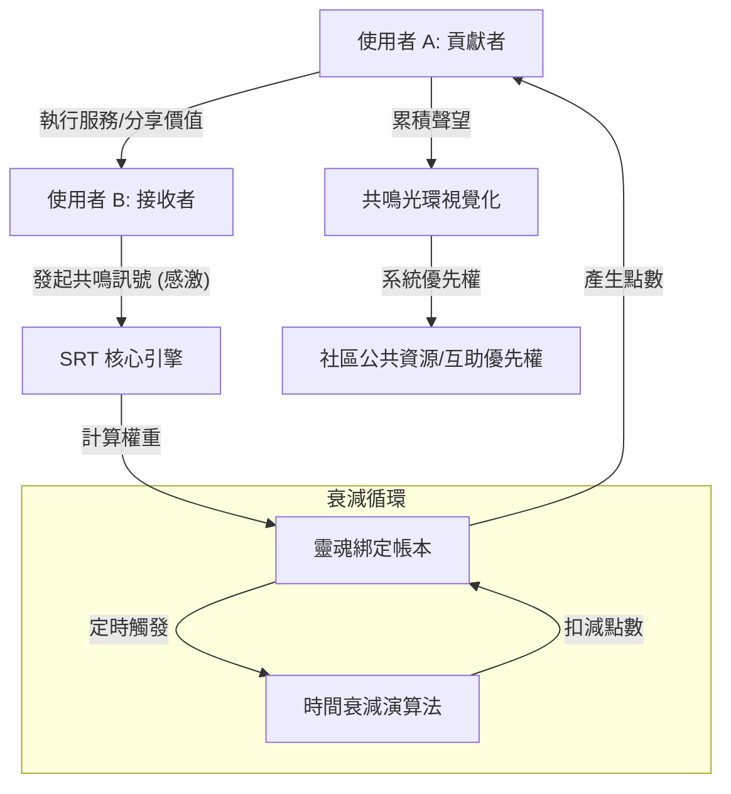

# SRT 社會共鳴代幣系統設計草案 (Social Resonance Token System)

## 1. 設計願景 (Vision)
旨在建立一個「軟體定義的共同體 (Software-defined Community)」，透過數位技術重建類似《海岸村恰恰恰》公辰村那種具備高度韌性、人情連結與「人類價值循環」的非貨幣社會經濟系統。

## 2. 核心架構 (Core Architecture)

### 2.1 靈魂綁定身分層 (Identity Layer)
- **技術**：採用 Soulbound Tokens (SBT) 概念。
- **特性**：代幣與個人身分永久綁定，**不可轉讓、不可交易**。
- **目的**：確保聲望價值的真實性，防止資本介入。

### 2.2 多維度價值標記 (Multi-dimensional Tagging)
- **維度 A：功能性 (Functional)** - 技術、勞動、專業知識。
- **維度 B：社會性 (Relational)** - 情緒支援、矛盾調解、資訊傳遞。
- **維度 C：存續性 (Legacy)** - 經驗分享、文化傳承、失敗教訓。

### 2.3 發行與獲取機制 (Issuance)
- **共鳴觸發 (Resonance Trigger)**：當 A 完成對 B 的協助後，由 B 發起「感激/認可」訊號。
- **權重演算**：認可者的聲望（共鳴光環）越高，被認可者獲得的代幣能量越強。

### 2.4 時間衰減機制 (Time Decay)
- **半衰期設定**：若使用者長期不參與社會互動，其代幣價值會自動緩慢下降。
- **目的**：強制資源流動，防止功勞囤積，鼓勵「活在當下的貢獻」。

## 3. 視覺化與互動 (Aura & Interface)
- **共鳴光環 (Aura)**：將抽象的聲望轉化為視覺化的氣場圖示，直覺顯示一個人的「社會連結度」。
- **價值導航 AI**：利用 LLM 挖掘個人隱性價值，並主動媒合社區需求與閒置人力。

## 4. 系統流程圖 (Mermaid)

## 5. 預期效應
- **從「競爭」轉向「互助」**：衡量成功的指標不再是存款，而是對社群的共鳴度。
- **發掘潛在價值**：讓原本被線性經濟定義為「廢棄」的人才重新獲得循環。
- **建立文明韌性**：降低對外部貨幣系統的依賴，強化在地社群的生存能力。

## 6. 批判思考與實作陷阱 (Critical Reflections & Risks)

雖然本系統在理論上能優化社會價值循環，但在實作層面存在以下深層悖論與不可行性：

### 6.1 善良的「貨幣化悖論」 (The Crowding-out Effect)
- **風險**：一旦將「利他行為」量化為點數，行為的動機將從「純粹的善意」轉向「利益的獲取」。
- **代價**：這種「動機排擠」可能殺死真正的共同體精神，讓原本溫暖的人情變成了冷冰冰的點數交易。

### 6.2 「黑鏡」式的數位監控 (Privacy vs. Participation)
- **風險**：為了精準捕捉隱性價值（如情緒支持），系統必須具備極強的監控與數據採集能力。
- **代價**：這可能演變為一種「數位獨裁」或「社會信用系統」，讓小社區的「守望相助」變成一種窒息的、無死角的互相監視。

### 6.3 系統性的「作弊與不公」
- **風險**：人類具備極強的「博弈本能」，可能出現互刷評分、社交表演等行為。
- **代價**：系統最終獎勵的可能是「擅長數位操作的人」而非「真正默默貢獻的人（如劇中的坎離奶奶）」，造成新的數位不平等。

### 6.4 總結：量化的極限
本系統設計的最大價值，或許不在於其「可操作性」，而在於其作為**「對照組」**的功能。它揭示了現代文明在追求效率時所遺失的、那些**「模糊但珍貴」**的人性機制。

**「公辰村」之所以美麗，或許恰恰是因為它沒有被量化。**

## 7. 數位文明的外部威脅：平台資本主義 (Platform Capitalism)

本系統面臨的最強大競爭者並非傳統貨幣，而是極致進化的「共享經濟平台」（如 Uber, TaskRabbit）。

### 7.1 便利性陷阱 (The Convenience Trap)
- **威脅**：當軟體媒合讓「付錢解決」變得極其高效時，人類會本能地選擇「交易」而非「連結」。
- **代價**：這種高效會加速社會資本的枯竭。我們用金錢換取了時間，卻失去了「被需要」的生命意義。

### 7.2 原子化勞動 vs. 韌性共同體
- **威脅**：數位平台將人變成「可隨時替換的服務單元」，這是一種「超線性」的勞動榨取。
- **對抗**：SRT 系統必須強調「不可替換性」與「關係的持續性」，而非單次的媒合效率。

## 8. 轉捩點：AI 作為「共鳴」的放大器 (AI for Resilience)

面對「金錢演算法」的壓縮，循環經濟的生存機會在於將技術導向「社會韌性」。

### 8.1 從「提取」轉向「連結」
- **現狀**：多數 AI 媒合是為了「提取手續費」（最短路徑的消耗）。
- **轉型**：循環 AI 應致力於「媒合隱性價值與深層連結」（最深路徑的循環）。

### 8.2 規模化人情味
- **願景**：利用 AI 處理人際關係中的複雜度（超越鄧巴數的限制），讓公辰村式的溫情能在數位時代進行「規模化實踐」。

---
**「這是一條艱難的逆風之路，但卻是通往真實世界、對抗系統性脆性的唯一捷徑。」**

---
**版本：v1.1 (Sociological Revision)**  
**紀錄日期：2026-05-09**
