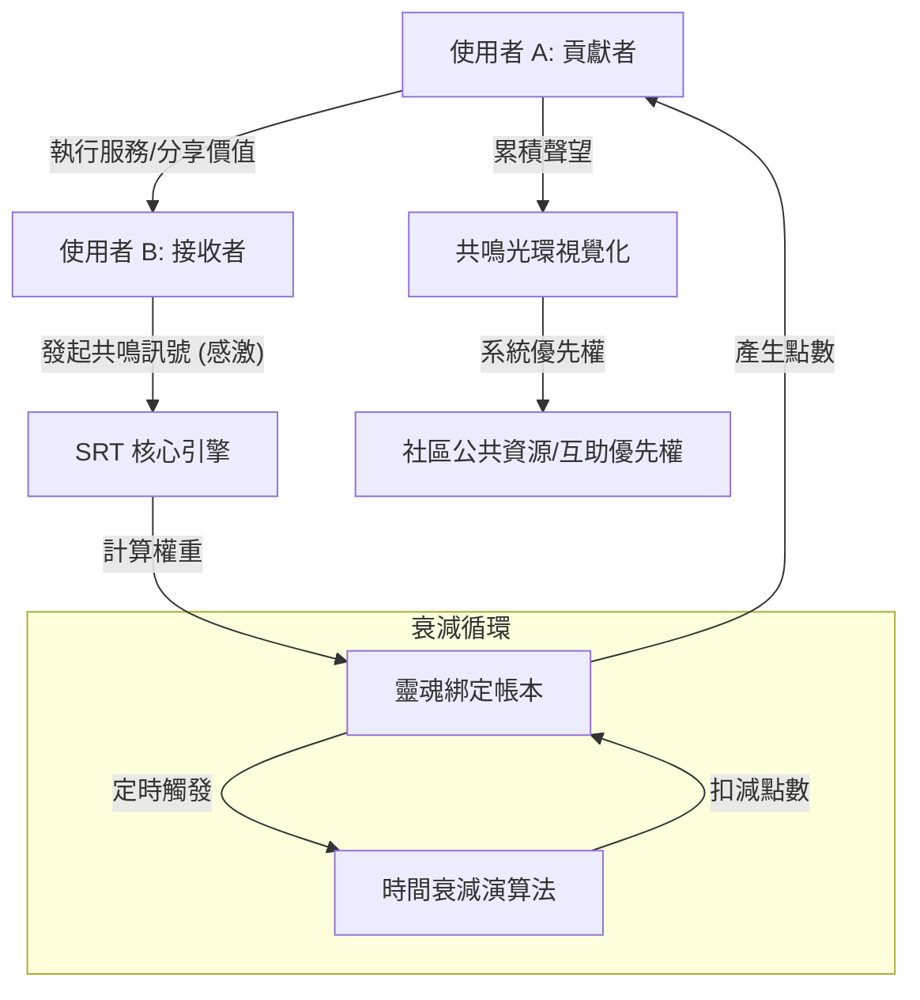

# SRT 社會共鳴代幣系統設計草案 (Social Resonance Token System)

## 1. 設計願景 (Vision)
旨在建立一個「軟體定義的共同體 (Software-defined Community)」，透過數位技術重建類似《海岸村恰恰恰》公辰村那種具備高度韌性、人情連結與「人類價值循環」的非貨幣社會經濟系統。

## 2. 核心架構 (Core Architecture)

### 2.1 靈魂綁定身分層 (Identity Layer)
- **技術**：採用 Soulbound Tokens (SBT) 概念。
- **特性**：代幣與個人身分永久綁定，**不可轉讓、不可交易**。
- **目的**：確保聲望價值的真實性，防止資本介入。

### 2.2 多維度價值標記 (Multi-dimensional Tagging)
- **維度 A：功能性 (Functional)** - 技術、勞動、專業知識。
- **維度 B：社會性 (Relational)** - 情緒支援、矛盾調解、資訊傳遞。
- **維度 C：存續性 (Legacy)** - 經驗分享、文化傳承、失敗教訓。

### 2.3 發行與獲取機制 (Issuance)
- **共鳴觸發 (Resonance Trigger)**：當 A 完成對 B 的協助後，由 B 發起「感激/認可」訊號。
- **權重演算**：認可者的聲望（共鳴光環）越高，被認可者獲得的代幣能量越強。

### 2.4 時間衰減機制 (Time Decay)
- **半衰期設定**：若使用者長期不參與社會互動，其代幣價值會自動緩慢下降。
- **目的**：強制資源流動，防止功勞囤積，鼓勵「活在當下的貢獻」。

## 3. 視覺化與互動 (Aura & Interface)
- **共鳴光環 (Aura)**：將抽象的聲望轉化為視覺化的氣場圖示，直覺顯示一個人的「社會連結度」。
- **價值導航 AI**：利用 LLM 挖掘個人隱性價值，並主動媒合社區需求與閒置人力。

## 4. 系統流程圖 (Mermaid)

## 5. 預期效應
- **從「競爭」轉向「互助」**：衡量成功的指標不再是存款，而是對社群的共鳴度。
- **發掘潛在價值**：讓原本被線性經濟定義為「廢棄」的人才重新獲得循環。
- **建立文明韌性**：降低對外部貨幣系統的依賴，強化在地社群的生存能力。

---
**版本：v0.1 (Concept Phase)**  
**設計來源：基於《韓劇羅曼史解讀手冊》與 AI 深度對話之產出**
